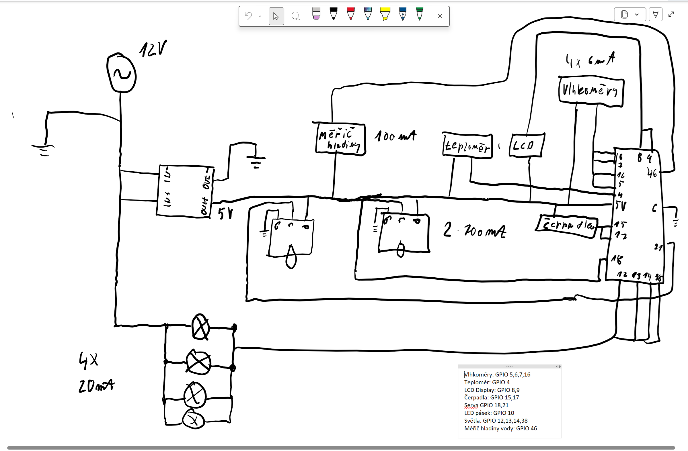
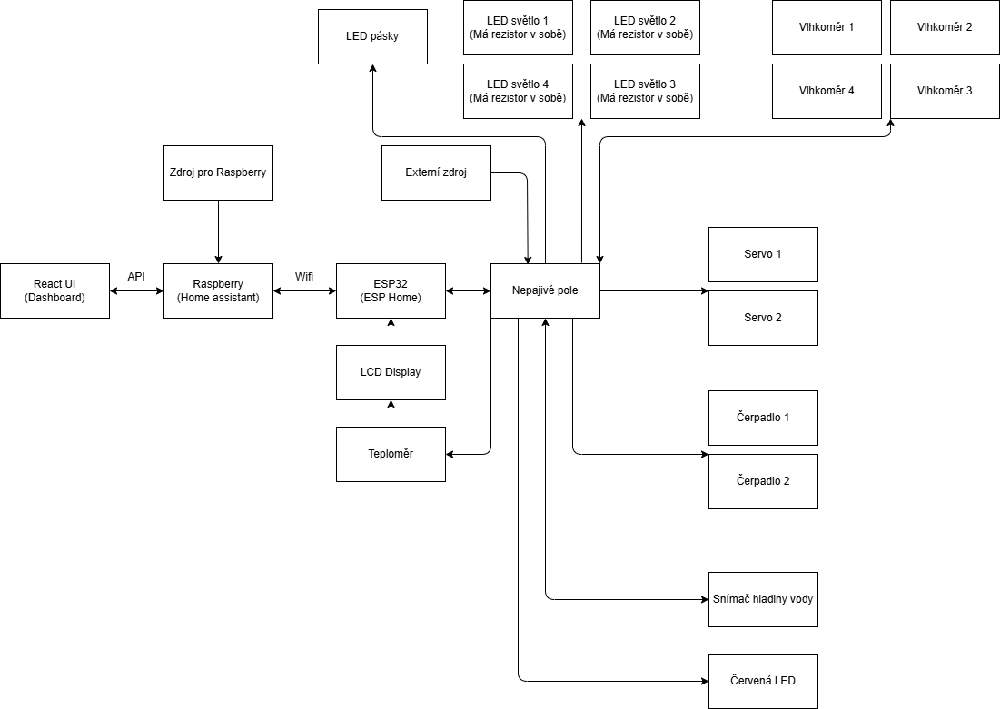

# Skleník 🌱

IoT projekt inteligentního skleníku postavený na kombinaci **ESP32 (ESPHome)** a **Raspberry Pi 5 (Home Assistant)**.  
Systém sbírá data ze senzorů a automaticky řídí zavlažování, větrání a osvětlení.

---

##  Architektura

### Elektrické zapojení

### Blokové schéma

---

##  Architektura systému

- **Frontend:** React (Dashboard)
- **Backend:** Raspberry Pi 5 (Home Assistant)
- **Mikrořadič:** ESP32 (ESPHome)
- **Komunikace:** WiFi

### Jak to funguje

- **ESPHome (na ESP32)**  
  - čte senzory  
  - ovládá čerpadla, serva, světla  
  - komunikuje přes WiFi  

- **Home Assistant (na Raspberry Pi)**  
  - centrální logika systému  
  - automatizace (scénáře)  
  - API pro dashboard  

- **React Dashboard**  
  - zobrazení dat  
  - manuální ovládání  

---

##  Integrace

- Zavlažování (čerpadla)
- Senzory vlhkosti půdy
- Senzor vlhkosti vzduchu
- Teplota vzduchu
- Ovládání oken (serva)
- LED osvětlení
- Měření hladiny vody

---

##  Scénáře

| Situace | Akce |
|--------|------|
| Moc vedro | Otevřít okna |
| Nízká vlhkost půdy | Spustit zavlažování |
| Noc | Ztlumit světlo |
| Málo vody v nádrži | Upozornění + blokace zalévání |

---

##  Komponenty a spotřeba

| Komponenta | Napětí | Proud | Poznámka | Datasheet|
|-----------|--------|--------|---------|---------|
| ESP32 | 5V | ~200 mA | WiFi + řízení | https://documentation.espressif.com/esp32-s3_datasheet_en.pdf |
| Raspberry Pi 5 (4GB) | 5V | 2–3 A | Home Assistant | https://rpishop.cz/raspberry-pi-5/6497-raspberry-pi-5-4gb-ram.html?utm_source=google&utm_medium=cpc&utm_campaign=CZ-SEA-%20Raspebrry%20Pi&utm_id=18792411511&gad_source=1&gad_campaignid=18792411511&gbraid=0AAAAApAQKp3EmpKmEvZjclBx3zBa8qhno&gclid=Cj0KCQjw-pHPBhCdARIsAHXYWP-Hg7E8t6e_8CUXK1lATffSK5f4Jobdth4E32DmEQC5K9lGIEwUl6caAkbpEALw_wcB#tab-description |
| LCD displej | 5V | ~100 mA | | https://dratek.cz/docs/produkty/1/1378/1487765909.pdf?_gl=1*1lcc2oe*_up*MQ..*_gs*MQ..&gclid=Cj0KCQjw-pHPBhCdARIsAHXYWP_kx3N-6NgD5iLtpf5ferptO-EJAw0RjltTGvcAB_AJGGErsgwrwr0aAiYJEALw_wcB&gbraid=0AAAAACVG_WemMFPAzeLpPWxesjmTq0Fxh |
| Teploměr | 5V | ~5 mA | |  | https://dratek.cz/docs/produkty/0/758/eses1500635996.pdf?_gl=1*1lcc2oe*_up*MQ..*_gs*MQ..&gclid=Cj0KCQjw-pHPBhCdARIsAHXYWP_kx3N-6NgD5iLtpf5ferptO-EJAw0RjltTGvcAB_AJGGErsgwrwr0aAiYJEALw_wcB&gbraid=0AAAAACVG_WemMFPAzeLpPWxesjmTq0Fxh |
| Vlhkoměry (4x) | 5V | ~24 mA | ~6 mA/ks | https://dratek.cz/docs/produkty/1/1862/1531824339.pdf |
| Měřič hladiny vody | 5V | ~100 mA | odhad | https://dratek.cz/docs/produkty/1/1677/1449950044.pdf |
| Čerpadla (2x) | 12V | ~1400 mA | 700 mA/ks | https://dratek.cz/arduino-platforma/122166-ponorne-cerpadlo-mini-ultra-tiche-dc-3-5v-120-l-h-s-usb.html |
| Serva (2x) | 5–6V | ~1000 mA | 500mA/ks | | https://dratek.cz/docs/produkty/0/741/eses1420669476.pdf |
| LED světla (4x) | 12V | ~80 mA | ~20 mA/ks | https://dratek.cz/arduino-platforma/51390-signalni-led-svetlo-22mm-ac-dc-24v-bila.html |
| Dioda červena | 5V | 20 mA| | 175 ohmu | | https://dratek.cz/docs/produkty/1/1570/1434543966.pdf |

---

##  Napájení

- **12V externí zdroj (doporučeno min. 5A)**
- Step-down měnič:
  - 12V → 5V (ESP32, senzory)

### Doporučení
- oddělit napájení:
  - logika (ESP32)
  - výkon (čerpadla, LED)

---

##  GPIO (ESP32)

| Funkce | GPIO |
|--------|------|
| Vlhkoměry | 4, 5, 6, 7 |
| Teploměr | 1 |
| LCD | sda 8, scl 9 |
| Čerpadla | USB? |
| Serva | 10, 11 |
| LED pásek | X |
| LED světla | 12, 13, 14, 38 |
| Hladina vody | 15 |

---

##  Komunikace

- ESP32 komunikuje přes **ESPHome API**
- Home Assistant funguje jako **centrální mozek**
- Dashboard komunikuje přes HTTP/API

---

## 📌 Poznámky

- ESP32 řeší real-time řízení hardware
- Home Assistant řeší logiku a automatizace

---
